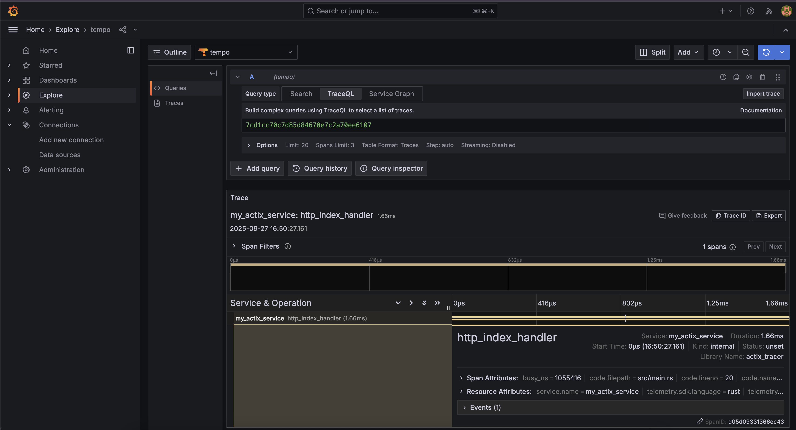

# PoC Rust Actix Opentelemetry

### Quick
1. Run service 
    ```sh
    $ cargo run
    ```
2. Test endpoint
     ```sh
    $ curl http://localhost:8080
    ```
3. Result Log
    ```sh
    $ cargo run
    Compiling rust-actix-with-otel v0.1.0 (/rust-actix-with-otel)
    Finished `dev` profile [unoptimized + debuginfo] target(s) in 3.15s
    Running `target/debug/rust-actix-with-otel`
    {"timestamp":"2025-09-27T09:42:36.617829+00:00","level":"INFO","fields":{"message":"INFO starting 8 workers"},"span":{"name":""}}
    {"timestamp":"2025-09-27T09:42:36.617923+00:00","level":"INFO","fields":{"message":"INFO Actix runtime found; starting in Actix runtime"},"span":{"name":""}}
    {"timestamp":"2025-09-27T09:42:36.617992+00:00","level":"INFO","fields":{"message":"INFO starting service: "actix-web-service-0.0.0.0:8080", workers: 8, listening on: 0.0.0.0:8080"},"span":{"name":""}}
    {"timestamp":"2025-09-27T09:50:27.163290+00:00","level":"INFO","trace_id":"7cd1cc70c7d85d84670e7c2a70ee6107","span_id":"d05d09331366ec43","fields":{"message":"INFO http_index_handler: Processing request in index handler"},"span":{"name":"http_index_handler"}}
    ```
3. Result Tempo
    